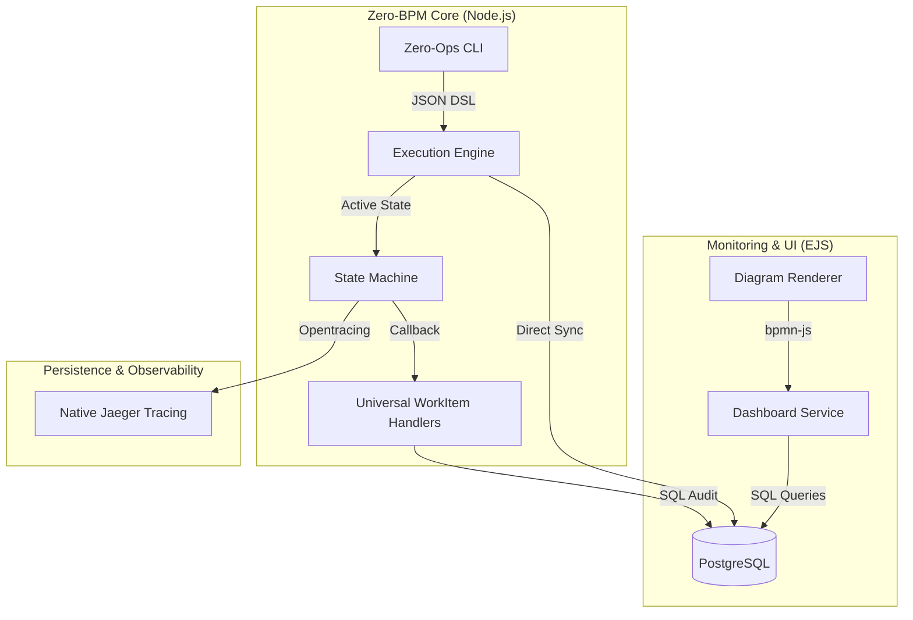

# Zero-BPM: Native Node.js Workflow Orchestration - Solution Document

## 1. Executive Summary
**Zero-BPM** is a high-performance, native Node.js workflow orchestration engine designed to provide the full power of enterprise BPM (jBPM/Camunda) with the agility and simplicity of the JavaScript ecosystem. It replaces the heavy Java-based KIE Execution Plane with a lightweight, event-driven state machine that offers 100% functional parity in auditing, monitoring, and visual path tracking.

---

## 2. The "Grand Unification" Architecture
The system is now a unified Node.js application that manages both orchestration and execution, utilizing PostgreSQL as a single source of truth for both state and audit history.

---

## 3. High-Fidelity Persistence Schema
Zero-BPM replicates the granular auditing of jBPM through a native PostgreSQL schema. This ensures total history tracking and path visualization (the "blue line" tracking).

| Node-Native Table | jBPM Parity | Functional Support |
| :--- | :--- | :--- |
| `zero_instances` | `ProcessInstanceLog` | Tracks overall instance health (Running/Error/Completed). |
| `zero_nodes` | `NodeInstanceLog` | **Visual Parity**: Records every node entry/exit with timestamps. Used to draw the animated blue path. |
| `zero_variables` | `VariableInstanceLog` | Stores every change to variables, allowing you to "tavel back in time" to see state at any point. |
| `zero_tasks` | `Task` | Manages Wait-States and Human Interaction flow. |

---

## 4. Operational Parity Features

### 4.1 Native State Rehydration
Zero-BPM avoids "memory-only" execution. If the Node.js server crashes:
1.  The Engine queries `zero_instances` for "In-Progress" workflows.
2.  It cross-references `zero_nodes` to find the last successfully completed step.
3.  It re-initializes the state machine precisely at the crash point and resumes execution.

### 4.2 Universal Plugin System
The `UniversalHandler` is no longer a Java class. It is a **Node.js Plugin system** where developers can add custom logic (REST, Shell, Lambda, Email) as standard JS modules.

### 4.3 Automatic BPMN Compilation
To provide the "BPMN Experience," the CLI automatically translates JSON flows into standard BPMN2 XML. This XML is stored in the database and used by the **Diagram Renderer** to show live execution tracking.

---

## 5. UI & Monitoring (Visual Parity)
Zero-BPM uses a server-side rendered **EJS Dashboard** to provide:
- **Live Monitoring**: Real-time view of running instances.
- **Historic Walkthrough**: Ability to click on a finished process and see the highlighted diagram of the path taken.
- **Error Diagnostics**: Deep linking from failed nodes to log entries in the database.

---

## 6. Implementation Lifecycle
1.  **Design**: Define JSON Flow.
2.  **Generate**: Node.js calculates the BPMN2 XML and stores it in Postgres.
3.  **Execute**: `node zero-ops engine run <flow>`.
4.  **Observe**: Open `http://localhost:3000/dashboard` to see the animated execution tracking.
