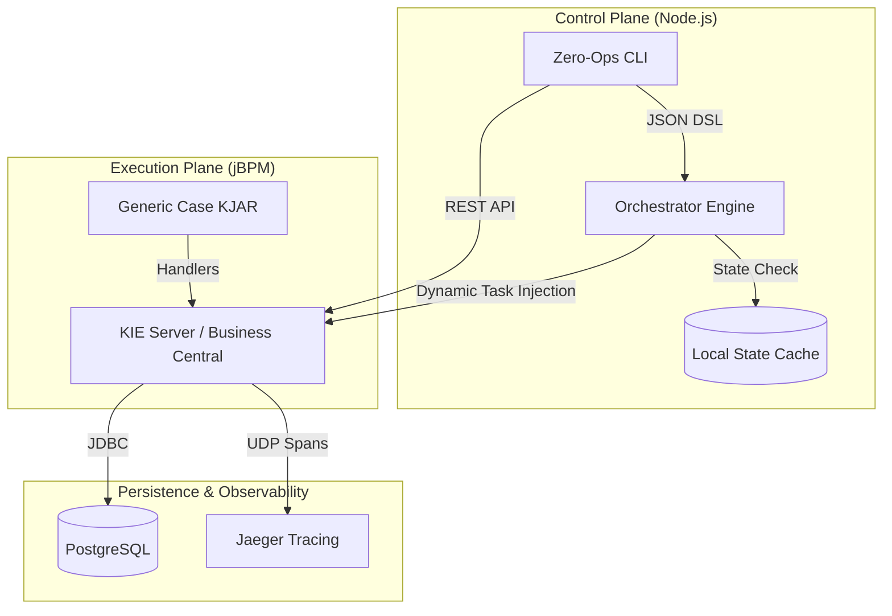
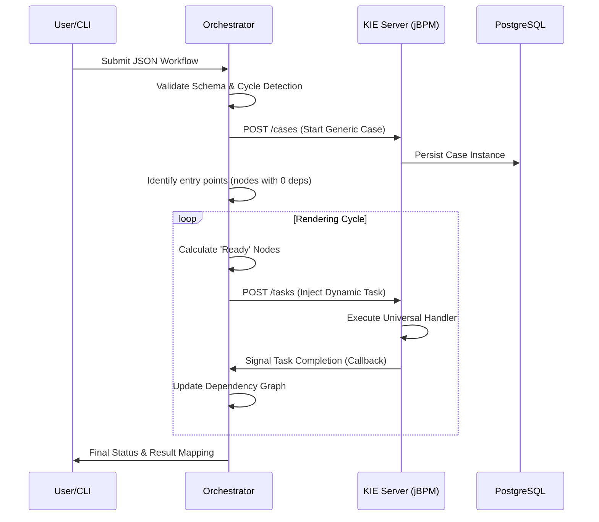

# jBPM Generic Flow Interpreter - Enterprise Solution Document

## 1. Executive Summary
The **Zero-Flow Generic Interpreter** is an enterprise-grade workflow orchestration engine built on jBPM. It moves process logic away from static, compiled BPMN files and into dynamic, data-driven JSON configurations. This allows organizations to build, deploy, and update complex business processes in real-time with zero downtime and no recompilation.

---

## 2. System Architecture
The solution consists of three primary layers: the **Control Plane** (Node.js Orchestrator), the **Execution Plane** (jBPM), and the **Persistence/Observation Plane** (PostgreSQL & Jaeger).

---

## 3. The Runtime Rendering Logic
The "Renderer" is a state-machine that interprets the JSON DSL and translates it into a sequence of jBPM Ad-hoc task injections.

### 3.1 The Interpretation Pipeline

---

## 4. Core Algorithms

### 4.1 Dependency Satisfaction Algorithm
The Orchestrator maintains a status registry for all nodes in the DSL.
- **Trigger Condition**: A node $N$ is eligible for execution if and only if $\forall D \in Dependencies(N), Status(D) = \text{'COMPLETED'}$.
- **Parallelism**: Multiple nodes meeting the trigger condition are injected simultaneously.

### 4.2 State Rehydration (Fault Tolerance)
To handle Orchestrator crashes or restarts:
1.  On startup, the Orchestrator queries the KIE Server: `GET /cases/instances/{id}/tasks`.
2.  It retrieves the set of already completed tasks.
3.  It updates its local status registry to reflect the actual state in the database.
4.  It resumes the Rendering Cycle from the next available `Ready` nodes.

### 4.3 Variable Scoping & Interpolation
- **Input Scoping**: Before task injection, the orchestrator resolves variables using the pattern `${scope.variable}`.
- **JSONPath Extraction**: Upon task completion, the orchestrator applies JSONPath filters defined in the `outputMapping` to save results into the global Case File.

---

## 5. Infrastructure & Deployment
The system is fully containerized for Apple Silicon (ARM) and AMD64 hosts.

### 5.1 Docker Setup
- **[docker-compose.yml](./docker/docker-compose.yml)**: Orchestrates jBPM, Jaeger, and persistence.
- **[.env](./docker/.env)**: Centralized configuration for PostgreSQL (including custom schema support).

---

## 6. Comprehensive Node Specification
Refer to the specialized technical guides for configuration schemas:
- **[Full Node Library](./docs/nodes/)**: Detailed guide for all 23+ supported node types.

---

## 7. End-to-End Operational Lifecycle
1.  **DSL Phase**: Construct JSON configuration.
2.  **Setup Phase**: Deploy Generic KJAR and start Docker containers.
3.  **Initiation**: `zero-ops jbpm run <file>`.
4.  **Audit**: Monitor execution via Jaeger UI at `http://localhost:16686`.
